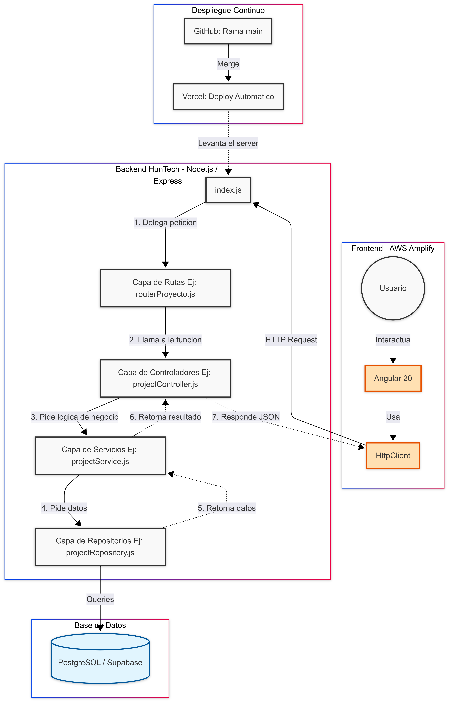

# BACKEND-HUNTECH
Proyecto académico para la materia Desarrollo de Sistemas Web (Back End) y Proyecto Integrador.
Este proyecto maneja la lógica de negocio, persistencia de datos y provee los endpoints necesarios para el frontend en Angular.

## Arquitectura del Sistema

El backend está construido bajo un modelo de arquitectura en capas para asegurar el desacoplamiento y facilitar el mantenimiento. 

 
### Estructura de Capas
* **Routes:** Definen los endpoints de la API y delegan la petición.
* **Controllers:** Reciben la petición HTTP, validan los datos de entrada y manejan las respuestas.
* **Services:** Contienen la lógica de negocio y validaciones complejas.
* **Repositories:** Gestionan la comunicación directa con la base de datos PostgreSQL.

## Tecnologías Utilizadas

* **Entorno de ejecución:** Node.js
* **Framework:** Express.js
* **Base de Datos:** PostgreSQL (alojada en Supabase)
* **Despliegue:** Vercel
* **Documentación:** Swagger

## Instalación y Ejecución Local

1. Clonar el repositorio:
   ```bash
        git clone https://github.com/monick96/BACKEND-HUNTECH.git
   ```
2. Instalar las dependencias:
    ```Bash
        npm install
    ```
3. Configurar variables de entorno:

    Crear un archivo .env en la raíz del proyecto basándose en las variables necesarias para la conexión a la base de datos y la URL del frontend (CORS).

4. Iniciar el servidor:

    ```Bash
        node index.js
    ```
